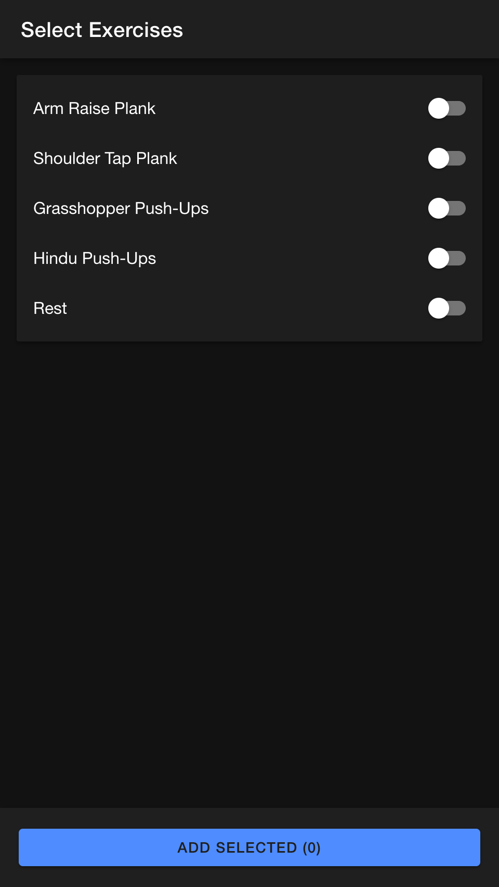
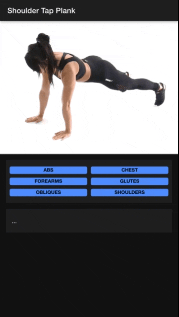
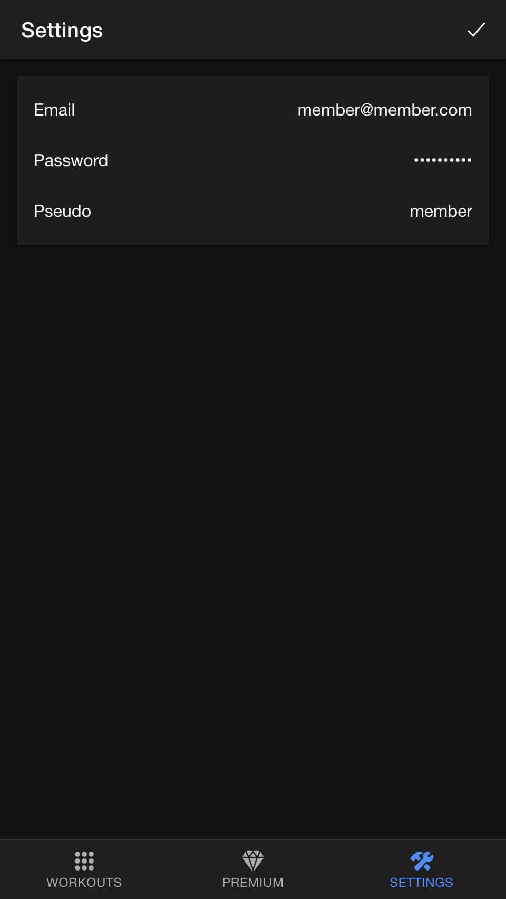
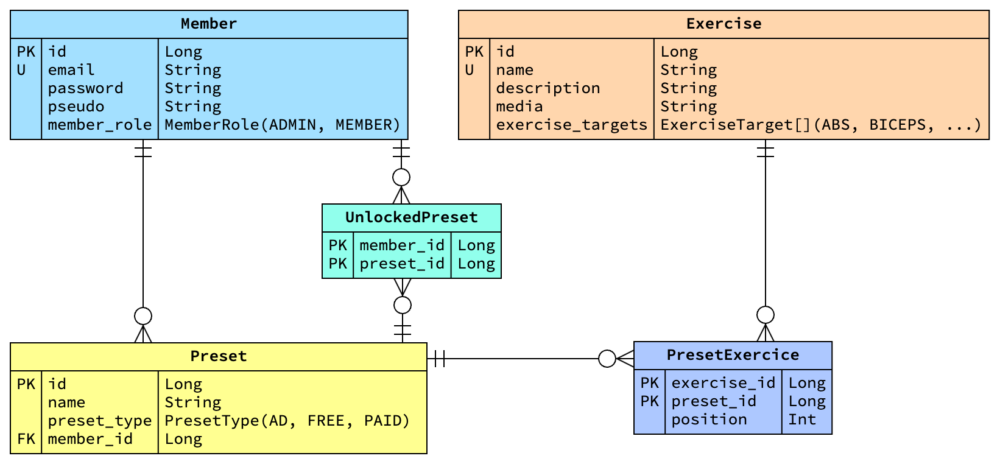

# <samp>OVERVIEW</samp>

Platform to create personalized workouts.

### Light mode


### Dark mode



# <samp>FEEDBACK</samp>

Fullstack application powered by a Spring REST API backend, designed with a three-tier architecture (presentation, business logic, and data access). The frontend is built with Ionic and Angular, delivering a responsive, cross-platform experience for both mobile and web users.

# <samp>GUIDANCE</samp>

### ER diagram



### Debug server

```
idea src/server
```

### Debug mobile

```shell
# For Android
cd src/mobile
npx cap copy android
npx cap sync android
npx cap open android

# For iOS
cd src/mobile
npx cap copy ios
npx cap sync ios
npx cap open ios
```
