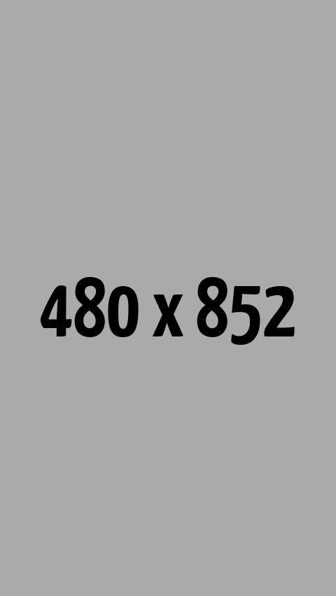
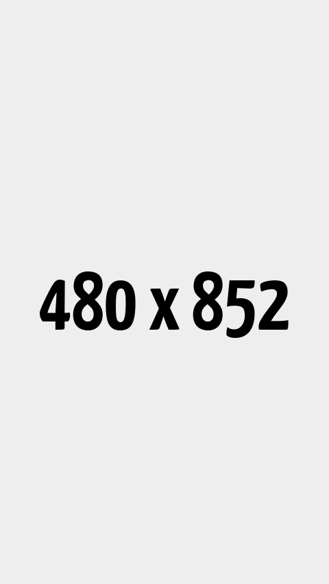
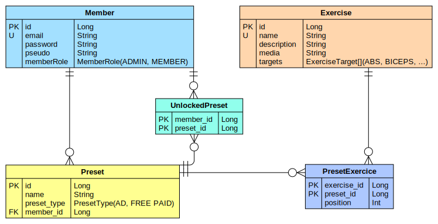

# <samp>OVERVIEW</samp>

Spring backend with Ionic mobile application to create own personalized workouts.

## Mobile



## Schema



# <samp>FEATURES</samp>

- ...

# <samp>GUIDANCE</samp>

### Debug server

```
idea src/server
```

### Debug mobile

```shell
# For Android
cd src/mobile
npx cap copy android
npx cap sync android
npx cap open android

# For iOS
cd src/mobile
npx cap copy ios
npx cap sync ios
npx cap open ios
```
