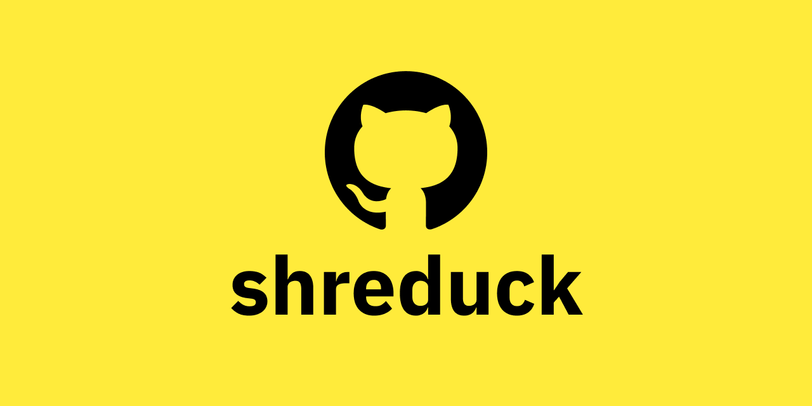
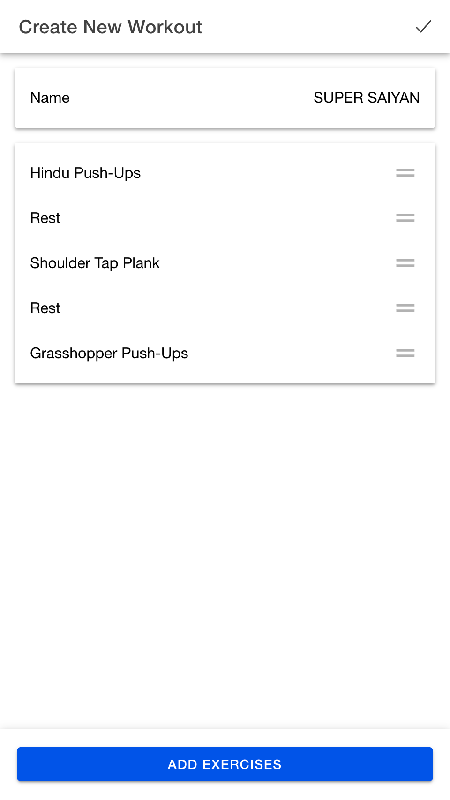
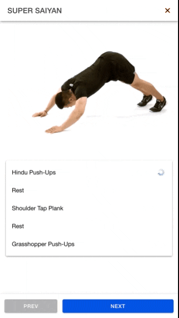
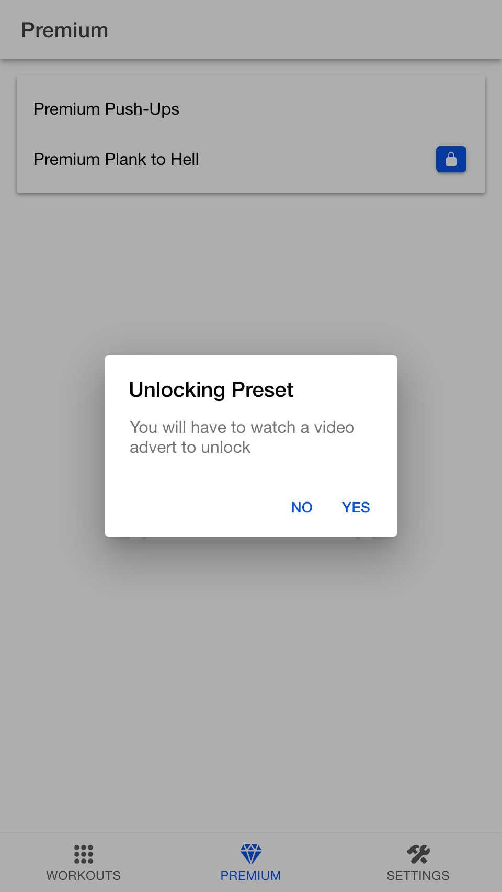
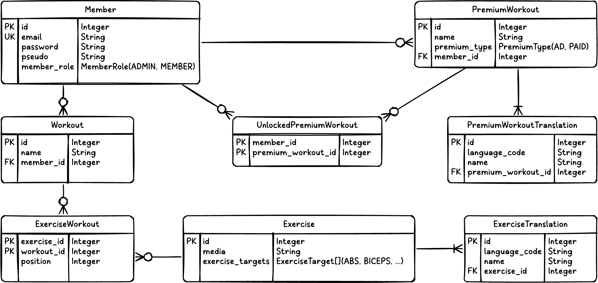

# <samp>OVERVIEW</samp>

Shreduck is a training platform where users can register and create their own workouts using a library of existing exercises. It features a premium system where ready-made workouts can be unlocked by watching ads.

The application is a fullstack monorepo combining a Spring Boot REST API backend with an Ionic and Angular frontend. Built with a three-tier architecture (presentation, business logic, data access), it delivers a responsive, cross-platform experience for both web and mobile users.

### Mobile Application



### ER Diagram



# <samp>GUIDANCE</samp>

### Debug Server

```
idea src/server
```

### Debug Mobile

```shell
# For Android
cd src/mobile
npx cap copy android
npx cap sync android
npx cap open android

# For iOS
cd src/mobile
npx cap copy ios
npx cap sync ios
npx cap open ios
```
