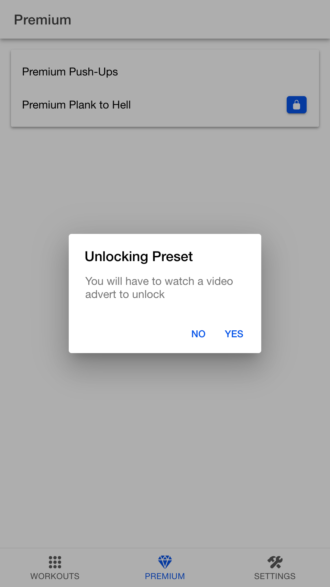
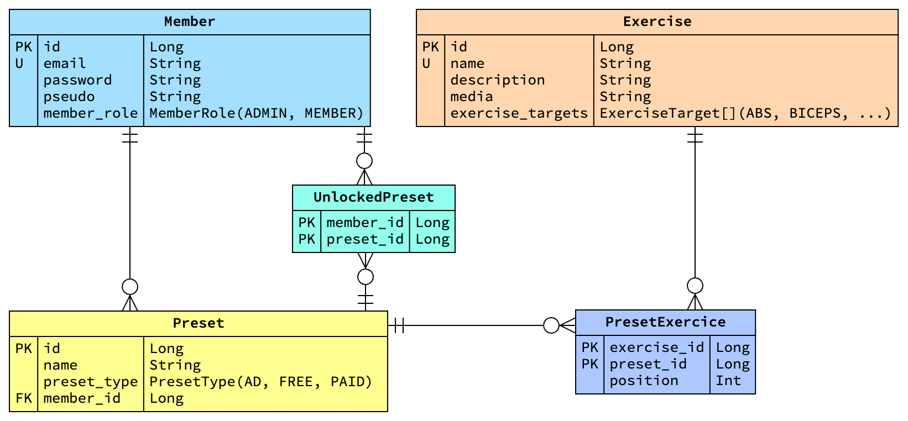

<p align="center"></p>
<h1 align="center"><samp>SHREDUCK</samp></h1>

<p align="center">Shreduck is a training platform where users can register and create their own workouts using a library of existing exercises. It features a premium system where ready-made workouts can be unlocked by watching ads. The application is a fullstack monorepo combining a Spring Boot REST API backend with an Ionic and Angular frontend, it delivers a responsive, cross-platform experience for both web and mobile users.</p>

<hr>

<h3 align="center">Mobile Application</h3>



<hr>

<h3 align="center">ER Diagram</h3>



<hr>

<h3 align="center">Debugging Server</h3>

###

```
idea src/server
```

<hr>

<h3 align="center">Debugging Mobile</h3>

```shell
# For Android
cd src/mobile
npx cap copy android
npx cap sync android
npx cap open android

# For iOS
cd src/mobile
npx cap copy ios
npx cap sync ios
npx cap open ios
```
